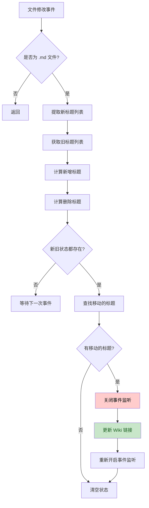
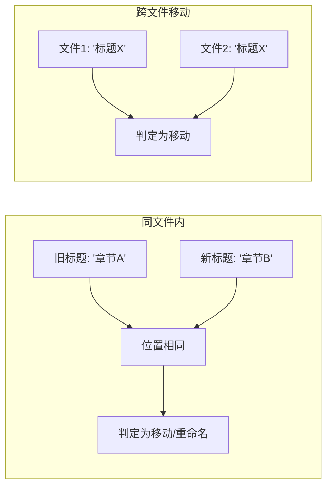
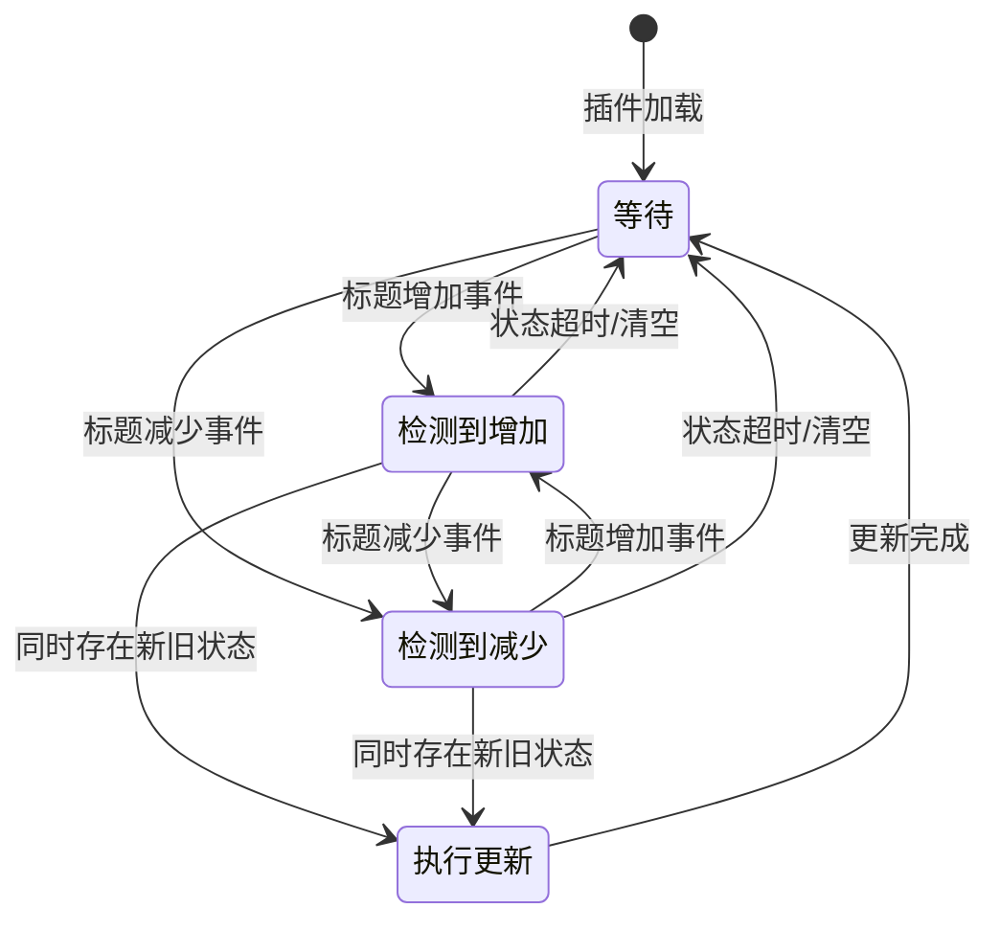

# Enhance Update Link

增强更新链接插件，会监控 Obsidian 笔记中的章节标题移动或修改，并自动更新指向原章节标题的 wiki 链接。

## 功能特性

- 🚀 **自动更新**：当检测到标题移动或重命名时，自动更新相关 wiki 链接
- 🔍 **智能匹配**：支持同文件内标题重命名和跨文件标题移动
- 🛡️ **安全防护**：具有完善的错误处理和状态管理机制

## 工作流程



## 核心逻辑详解

### 1. 事件监听与标题提取

当 Obsidian 检测到文件修改时：
1. 过滤非 Markdown 文件
2. 读取文件内容，使用正则表达式提取标题
3. 从 Obsidian 缓存获取修改前的标题信息

```typescript
// 标题提取正则
/^(#{1,6})\s+(.*)$/
```

### 2. 变化检测

通过对比新旧标题列表，识别：
- **新增标题**：在新文件中存在，但在旧文件中不存在的标题
- **删除标题**：在旧文件中存在，但在新文件中不存在的标题

### 3. 移动标题识别

根据新增和删除的标题列表，识别标题是否真正"移动"了：

| 场景 | 判断条件 |
|------|---------|
| 跨文件移动 | 不同文件中存在相同标题名的标题 |
| 同文件重命名 | 同一文件中位置相同但标题名不同 |



### 4. Wiki 链接更新

找到移动的标题后，遍历所有 Markdown 文件，更新匹配的 wiki 链接：

- 支持普通 wiki 链接：`[[文件名#标题|别名]]`
- 支持转义格式：`\[\[文件名#标题\]\]`

## 关键数据结构

### Heading 接口

```typescript
interface Heading {
    heading: string;   // 标题文本
    level: number;     // 标题级别 (1-6)
    position: number;  // 在文件中的行号
    file: TFile;       // 所属文件对象
}
```

### 实例状态管理

```typescript
modifiedFiles: {
    oldFile: TFile | null;  // 发生标题删除的文件
    newFile: TFile | null;  // 发生标题增加的文件
}

movedHeadings: {
    removedHeadings: Heading[];  // 被删除的标题
    addedHeadings: Heading[];    // 新增的标题
}
```

## 状态机转换



## 技术实现细节

### 原子性文件操作

使用 `vault.process()` 方法确保文件修改的原子性，避免在读取和写入之间被其他进程修改：

```typescript
await this.app.vault.process(targetFile, (content) => {
    // 在回调中进行替换操作
    return newContent;
});
```

### 事件监听管理

采用 `try-finally` 模式确保事件监听器始终被正确恢复：

```typescript
this.app.vault.off("modify", handler);
try {
    await this.updateWikiLinks(...);
} finally {
    this.app.vault.on("modify", handler);
}
```

### 竞态条件防护

使用局部变量捕获当前状态，立即清空实例变量防止并发干扰：

```typescript
const currentOldFile = this.modifiedFiles.oldFile;
const currentNewFile = this.modifiedFiles.newFile;
// 立即清空，防止后续事件干扰
this.modifiedFiles.oldFile = null;
this.modifiedFiles.newFile = null;
```

## 已知限制

> [!WARNING]
> **标题名冲突问题**：如果不同文件中存在相同标题名的标题，插件可能无法准确区分。例如：
> - 文件A删除了"颜色"标题
> - 文件B新增了"颜色"标题
> - 这种情况下会被误判为标题"移动"

> [!NOTE]
> **在位编辑**：当重命名一个标题时，既会产生"删除标题"事件，又会产生"增加标题"事件，因此会触发一次链接更新。

## 使用场景

- 📚 整理笔记结构时，自动更新相关链接
- 🔄 重命名章节标题，无需手动查找替换
- 📋 移动内容到其他文件时，保持链接有效性

## 调试模式

插件支持调试模式，可通过设置 `debug = true` 开启：

```typescript
debug = true;  // 开启调试模式
```

调试模式下会在控制台输出详细的处理日志，包括：
- 文件修改事件触发信息
- 标题变化检测结果
- 链接更新详情
