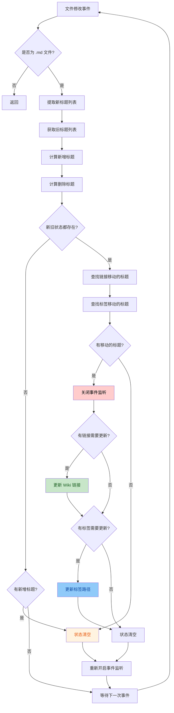
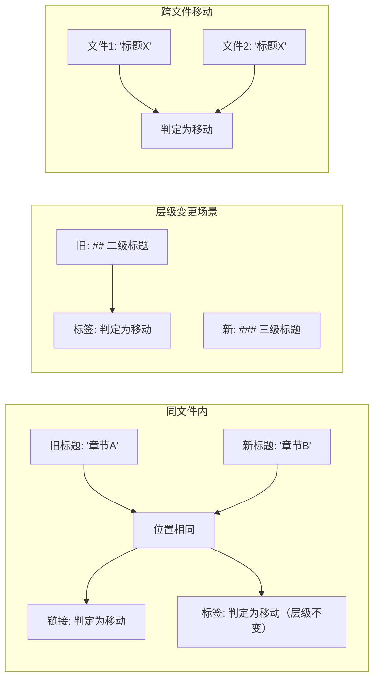
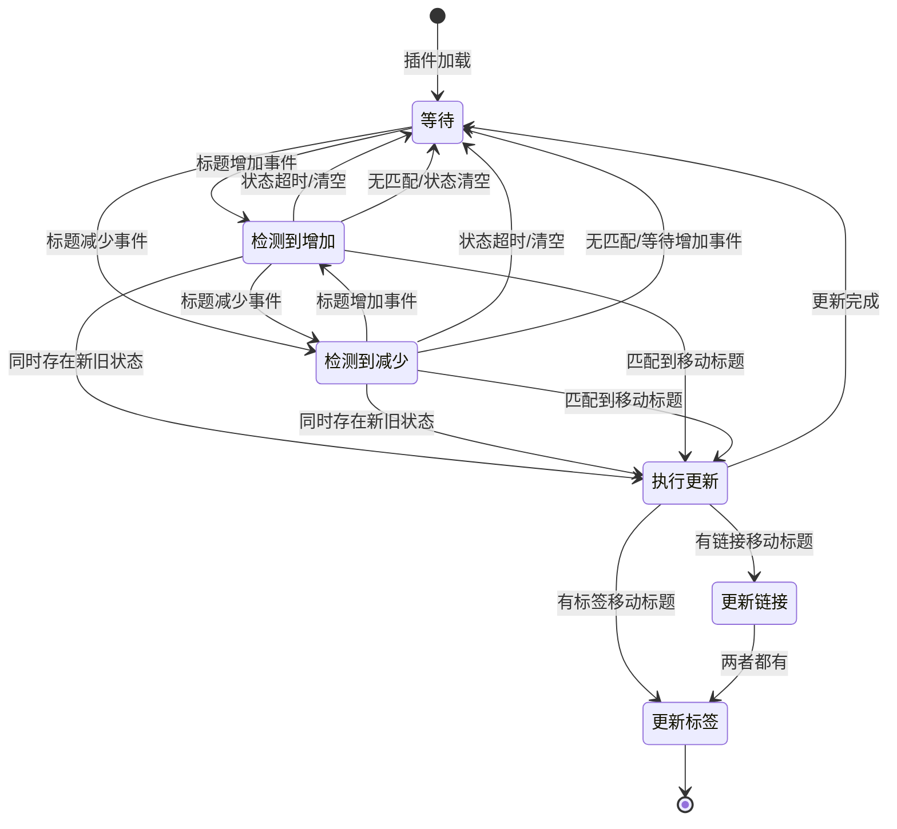

# Enhance Update Link

增强更新链接插件，会监控 Obsidian 笔记中的章节标题移动或修改，并自动更新指向原章节标题的 wiki 链接。

## 功能特性

- 🚀 **自动更新**：当检测到标题移动或重命名时，自动更新相关 wiki 链接
- 🏷️ **标签同步**：自动更新基于标题层级的标签路径（`#一级/二级/三级` 格式）
- 🔍 **智能匹配**：支持同文件内标题重命名和跨文件标题移动
- 🛡️ **安全防护**：具有完善的错误处理和状态管理机制

## 工作流程



## 核心逻辑详解

### 1. 事件监听与标题提取

当 Obsidian 检测到文件修改时：
1. 过滤非 Markdown 文件
2. 读取文件内容，使用正则表达式提取标题
3. 从 Obsidian 缓存获取修改前的标题信息

```typescript
// 标题提取正则
/^(#{1,6})\s+(.*)$/
```

### 2. 变化检测

通过对比新旧标题列表，识别：
- **新增标题**：在新文件中存在，但在旧文件中不存在的标题
- **删除标题**：在旧文件中存在，但在新文件中不存在的标题

### 3. 移动标题识别

根据新增和删除的标题列表，识别标题是否真正"移动"了。系统使用两种识别策略，分别用于链接更新和标签更新：

#### 3.1 Wiki 链接移动识别

| 场景 | 判断条件 |
|------|---------|
| 跨文件移动 | 不同文件中存在相同标题名的标题 |
| 同文件重命名 | 同一文件中位置相同但标题名不同 |

#### 3.2 标签移动识别

| 场景 | 判断条件 |
|------|---------|
| 跨文件移动 | 不同文件中存在相同标题名的标题 |
| 同文件层级变更 | 同一文件中位置相同但标题名或层级（1-6级）不同 |



### 4. Wiki 链接更新

找到需要更新链接的移动标题后，遍历所有 Markdown 文件，更新匹配的 wiki 链接：

- 支持普通 wiki 链接：`[[文件名#标题|别名]]`
- 支持转义格式：`\[\[文件名#标题\]\]`

### 5. 标签路径更新

找到需要更新标签的移动标题后，自动更新基于标题层级的标签路径。

#### 5.1 标签格式说明

插件支持 Obsidian 的层级标签格式，标签路径会自动根据标题的层级结构构建：

```
#一级标题/二级标题/三级标题
```

例如，对于以下文件结构：
```markdown
# 项目笔记
## 前端开发
### React 组件
```

如果标题 `# React 组件` 发生移动或重命名，相关的层级标签 `#项目笔记/前端开发/React 组件` 会自动更新。

#### 5.2 标签构建算法

```typescript
function buildTags(content: string, heading: string): string {
    // 从文件末尾向前查找，构建完整的层级标签路径
    // 找到目标标题后，继续向上查找父标题
    // 层级越低（数字越大），标签路径越深
}
```

#### 5.3 标签匹配模式

```typescript
// 匹配基于标题的标签
const tagPattern = new RegExp(
    `#${prefix}(\\S*?)${heading}([\n/ ])`,
    "g"
);
```

#### 5.4 标签更新示例

| 操作 | 旧标签 | 新标签 |
|------|--------|--------|
| 重命名标题 | `#项目笔记/前端开发/React组件` | `#项目笔记/前端开发/Vue组件` |
| 移动文件 | `#项目笔记/前端开发/Vue组件` | `#项目笔记/后端开发/Vue组件` |
| 变更层级 | `#项目笔记/Vue组件` | `#项目笔记/前端开发/Vue组件` |

## 关键数据结构

### Heading 接口

```typescript
interface Heading {
    heading: string;   // 标题文本
    level: number;     // 标题级别 (1-6)
    position: number;  // 在文件中的行号
    file: TFile;       // 所属文件对象
}
```

### 实例状态管理

```typescript
modifiedFiles: {
    oldFile: TFile | null;  // 发生标题删除的文件
    newFile: TFile | null;  // 发生标题增加的文件
}

movedHeadings: {
    removedHeadings: Heading[];  // 被删除的标题
    addedHeadings: Heading[];    // 新增的标题
}
```

## 状态机转换



### 状态清空机制

状态清空是标题修改事件终结的重要标志，以下情形都会触发状态清空：

| 触发时机 | 清空条件 | 说明 |
|---------|---------|------|
| 标题增加后 | `addedHeadings.length > 0` | 无论是否发生移动，只要检测到标题增加就清空 |
| 执行更新后 | 无论是否有移动标题 | 完成链接更新后清空所有状态 |


> [!NOTE]
> 新增标题的情形包括：
> - 单纯新增标题，没有移动、修改
> - 新增的标题是由其它位置移动过来的
> - 对原有标题进行修改
>
> 以上情形都标志着对标题修改事件的终结，状态必须清空以防止残留影响后续判断。

## 技术实现细节

### 原子性文件操作

使用 `vault.process()` 方法确保文件修改的原子性，避免在读取和写入之间被其他进程修改：

```typescript
await this.app.vault.process(targetFile, (content) => {
    // 在回调中进行替换操作
    return newContent;
});
```

### 事件监听管理

采用 `try-finally` 模式确保事件监听器始终被正确恢复：

```typescript
this.app.vault.off("modify", handler);
try {
    await this.updateWikiLinks(...);
} finally {
    this.app.vault.on("modify", handler);
}
```

### 竞态条件防护

使用局部变量捕获当前状态，立即清空实例变量防止并发干扰：

```typescript
const currentOldFile = this.modifiedFiles.oldFile;
const currentNewFile = this.modifiedFiles.newFile;
// 立即清空，防止后续事件干扰
this.modifiedFiles.oldFile = null;
this.modifiedFiles.newFile = null;
```

## 已知限制

> [!WARNING]
> **标题名冲突问题**：如果不同文件中存在相同标题名的标题，插件可能无法准确区分。例如：
> - 文件A删除了"颜色"标题
> - 文件B新增了"颜色"标题
> - 这种情况下会被误判为标题"移动"

> [!WARNING]
> **标签匹配限制**：标签更新功能仅支持基于标题路径的标签格式（`#路径/标题`），不支持：
> - 直接标签（无路径，如 `#标签名`）
> - 嵌套标签（手动创建的与标题无关的层级标签）
> - 仅包含父级标题的标签（如 `#项目笔记/前端开发`，但实际位置是 `#项目笔记` 下）

> [!WARNING]
> **标签修改的局限性**：
> - **新增**父级标题无法修改其子标题的标签路径，因为无法匹配到原标题，需要手动修改一下子标题触发。
> - 位于根目录的文件十分危险，因为它们没有路径前缀，极易被误修改。

> [!NOTE]
> **在位编辑**：当重命名一个标题时，既会产生"删除标题"事件，又会产生"增加标题"事件，因此会触发一次链接更新。

## 使用场景

- 📚 整理笔记结构时，自动更新相关链接和标签
- 🔄 重命名章节标题，无需手动查找替换
- 📋 移动内容到其他文件时，保持链接和标签有效性
- 🏷️ 调整标题层级结构时，自动更新层级标签路径

## 调试模式

插件支持调试模式，可通过设置 `debug = true` 开启：

```typescript
debug = true;  // 开启调试模式
```

调试模式下会在控制台输出详细的处理日志，包括：
- 文件修改事件触发信息
- 标题变化检测结果
- 链接更新详情（包括哪些文件被更新）
- 标签更新详情（包括构建的标签路径）
- 状态清空时机

## 日志系统

插件内置了完善的日志系统，支持将操作记录持久化到 Markdown 文件中。

### 日志文件位置

日志功能已封装在独立的模块中：
- **日志模块**：[src/logger.ts](file:///d:\code_project\obsidian-plugin\.obsidian\plugins\obsidian-plugin-enhance-update-link\src\logger.ts)
- **日志配置**：使用 `defaultLogConfig` 默认配置
- **日志实例**：通过 `this.logger` 访问

### 日志配置

```typescript
logConfig: {
    enabled: true,                              // 是否启用文件日志
    logPath: "插件日志/enhance-update-link.md", // 日志文件路径（相对于库根目录）
    maxLogSize: 1024 * 1024,                    // 最大日志文件大小（1MB），超过则归档
    consoleOutput: true,                        // 是否同时输出到控制台
}
```

### 日志类型

| 类型 | 图标 | 说明 |
|------|------|------|
| `link` | 🔗 | Wiki 链接更新记录 |
| `tag` | 🏷️ | 标签路径更新记录 |
| `error` | ❌ | 错误信息记录 |
| `info` | ℹ️ | 一般信息记录 |

### 日志格式示例

日志以 Markdown 格式存储，便于阅读和搜索：

```markdown
# Enhance Update Link 日志

> 自动生成的操作日志

---

## 🔗 LINK - 2024/1/15 14:30:25

**更新 Wiki 链接**

| 属性 | 值 |
|------|----|
| 目标文件 | 笔记/项目笔记.md |
| 源文件 | 笔记/技术文档.md |
| 旧标题 | React 组件 |
| 新标题 | Vue 组件 |

---

## 🏷️ TAG - 2024/1/15 14:30:26

**更新标签路径**

| 属性 | 值 |
|------|----|
| 目标文件 | 笔记/项目笔记.md |
| 源文件 | 笔记/技术文档.md |
| 旧标签 | 笔记/技术文档/React组件 |
| 新标签 | 笔记/技术文档/Vue组件 |

---
```

### 日志归档

当日志文件大小超过 `maxLogSize` 限制时，系统会自动归档旧日志：

- 原日志文件会被重命名为 `enhance-update-link-2024-01-15T14-30-00.md`
- 新日志文件会被创建，继续记录新的操作

### 自定义日志路径

你可以修改 `logPath` 配置来自定义日志存储位置：

```typescript
// 存储到根目录
logPath: "enhance-update-link.md"

// 存储到指定文件夹
logPath: "Logs/plugin-logs.md"

// 使用中文路径
logPath: "日志/链接更新日志.md"
```

### 日志 API

插件提供了以下日志记录方法：

```typescript
// 记录链接更新
await this.logLinkUpdate({
    targetFile: "笔记/项目笔记.md",
    sourceFile: "笔记/技术文档.md",
    oldHeading: "React 组件",
    newHeading: "Vue 组件"
});

// 记录标签更新
await this.logTagUpdate({
    targetFile: "笔记/项目笔记.md",
    sourceFile: "笔记/技术文档.md",
    oldTag: "笔记/技术文档/React组件",
    newTag: "笔记/技术文档/Vue组件"
});

// 记录错误
await this.logError("处理文件修改时发生错误", error);

// 记录一般信息
await this.logInfo("插件加载完成", { version: "1.0.0" });
```
